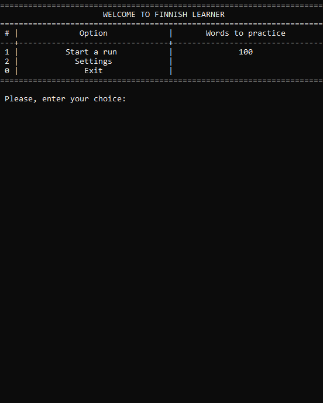
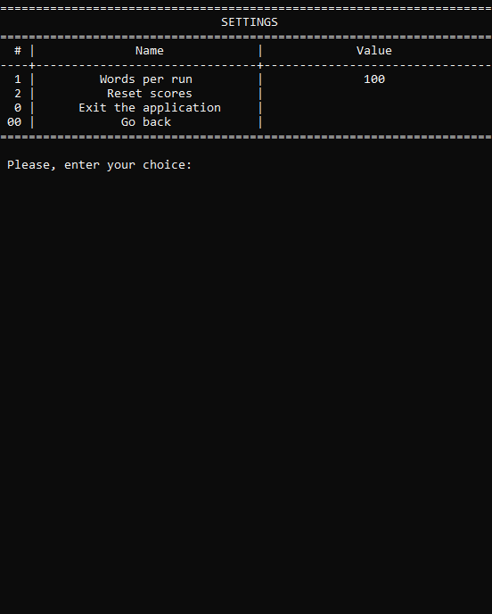
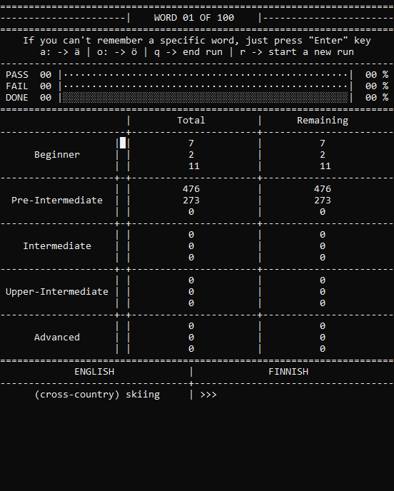
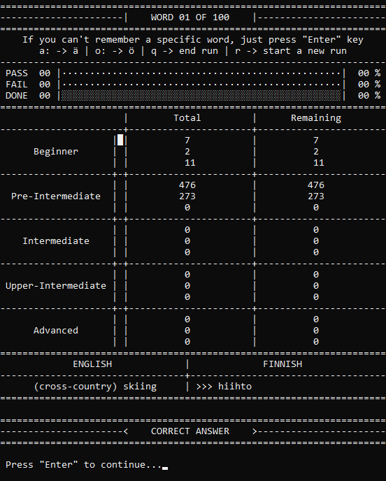

# FinnishWordsLearner
An easy and effective way to learn Finnish words.

# General idea
My idea was to create an app that would help learning foreign words, following these principles:
* **pick a word at random** so that you can't remember the order
* **show words that you got wrong first** so that you train  what you don't know first
* **focus on translation to the foreign language** not vice versa because this trains active vocabulary
* **make a user repeat a word one got wrong several times** to reinforce the right variant
* **have a nice looking UI** so that one could see one's statistics at a glance

# Quick start

**Note:** You MUST have Python installed on your PC. This app is only compatible with Windows OS.
1. **Clone this repository** any way you like
2. Open **START_ME.bat**
3. Enjoy :)

*The app will create a virtual environment folder and install all the dependencies on its own, not need to worry. The words in **all_words.xlsx** can be added or removed. Feel free to experiment.*

# Overview of the application
FinnishWordsLearner was 4 major screens:
* Welcome screen

* Settings screen

* Learning screen

* Results screen

